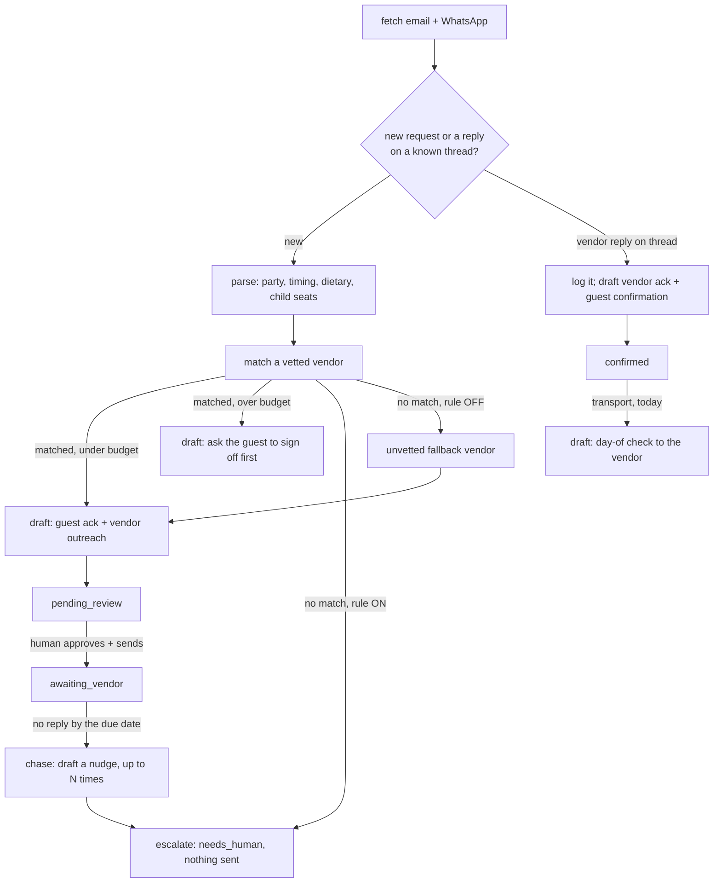

# Concierge AI — "The Fixer"

Handles concierge requests end-to-end: books restaurant tables, private chefs, and airport/VIP transfers on the guest's behalf.

## What it does

Handles concierge requests end-to-end: books restaurant tables, private chefs, and airport/VIP transfers on the guest's behalf. Requests flow in from every channel — the phone line, WhatsApp, email, the front desk. It sends both the guest acknowledgement and the provider request in the right language, logs every booking, tracks the provider's reply, follows up automatically until it's confirmed, and closes the loop back to the guest. On the day itself it runs a final check with the provider — flight number in hand for an airport pickup — and confirms to the guest that everything's on track.

### What it won't do

Escalates only the genuinely bespoke: unknown providers, large parties, anything a trusted partner flags. Won't promise a price it can't yet confirm; it secures the booking first, then confirms the detail.

### Why it matters

Concierge requests are high-delight, high-effort, and easy to drop. The guest gets a personal fixer who actually closes the loop (booking, chasing, confirming) without a staff member touching it.

### What to expect

Runs the full book → confirm → follow-up loop autonomously; turns a multi-touch ~15-min-per-request chore into zero-touch, and captures concierge revenue usually lost to "we'll get to it."

**ROI:** −90% on "Staff time per concierge request" (labor).

## Who it's for

- Independent hotels and small groups with a concierge desk that arranges
  private chefs, transfers, tickets, live music, and similar bespoke
  requests through a short list of local suppliers.
- Properties that already have (or want to build) a vetted supplier list and
  want every request logged, chased and closed without relying on someone's
  memory or a sticky note.
- A good companion to Front Desk AI (general guest email) and VIP AI
  (arrival briefs) — point a concierge-dedicated mailbox or WhatsApp number
  at this agent so it does not compete with Front Desk AI's inbox for the
  same messages.
- Not a fit if you have no outside suppliers at all, or if you need real-time
  price negotiation with vendors — this agent secures the booking at the
  vendor's stated rate; it does not haggle, and it will not invent a
  supplier that is not on your list.

## How it works



One loop, three tools: `tools/run.py` (fetch new requests and vendor
replies), `tools/chase.py` (the daily follow-up sweep), `tools/request.py`
(everything a human triggers by hand — a phone-in request, a guest's budget
decision, closing the loop, the day-of check). Every decision — parsing,
matching, estimating, the budget check — is deterministic Python
(`tools/engine.py`). The only model call in the normal loop translates a
guest-facing draft into their language — `make report --narrate` adds one
more, an opt-in one-line AI summary of the numbers. Neither ever decides
what gets booked. Full detail, the design decisions
taken where the spec was open, and the exact idempotency guarantees:
`docs/how-it-works.md`.

**Modes.** `shadow` (default): every draft waits for a human. `live`: an item
a human approved gets sent by `tools/review.py send` — nothing else changes.
See `docs/safety.md`.

**What runs when:**

| Workflow | Cadence | Provider used |
|---|---|---|
| New requests (`tools/run.py`) | every 15 minutes, or `make watch` | `llm.provider`, for translating guest-facing drafts |
| Follow-up sweep (`tools/chase.py`) | daily | none — a chase nudge is vendor-facing |
| Day-of check (`tools/request.py dayof-sweep`) | daily, morning | none — vendor-facing |
| Review queue (`tools/review.py`) | whenever a human is free | none |
| Coach (`tools/coach.py`, off by default) | weekly | `llm.provider` |
| `make report --narrate` (opt-in) | on demand | `llm.provider`, one summary line |

**No sub-agents are folded into this repo** — see §12. The Email Optimizer /
Coach AI layer does apply and is included, off by default.

## What you need

- **Python 3.11+.** `make setup` checks this for you.
- **To try the demo:** nothing else. It runs entirely on bundled fixtures.
- **To run it for real:**
  - A concierge-dedicated mailbox (IMAP app password, or Gmail OAuth) — this
    is both a guest-intake channel and the channel every vendor is contacted
    through.
  - WhatsApp, if guests reach your concierge desk that way (your own UniPile
    account, your own connected number) — optional.
  - Your PMS's CSV export, or Cloudbeds API access — optional; guest details
    can come from the inbound message itself, and the demo never needs this.
  - A way to think: the Claude Code session you already have open
    (`llm.provider: interactive` or `claude-code`, no extra cost) or your own
    Anthropic API key (`anthropic`). This is only ever used for translating a
    guest-facing draft (and, if you ask for it with `make report --narrate`,
    a one-line summary) — never for deciding what gets booked.
- **Time:** about 30–60 minutes to fill in `config/vendors.yaml` and
  `knowledge/property.md` for your property, then a few days of watching the
  review queue before considering `mode: live`.

## Quick start (5 minutes, no credentials)

```bash
git clone https://github.com/th1-ai/concierge-ai.git concierge-ai
cd concierge-ai
make setup
make demo
```

Expect to see exactly this:

```
Concierge AI demo - 6 sample inbound items from fixtures/inbound/

[info ] booked path: drafted guest ack + vendor outreach ref=REQ-1001 vendor=Chef Ines Duarte (vetted)
[info ] vendor confirmed, closing the loop ref=REQ-1001
[info ] escalated: no vetted vendor ref=REQ-1002 category=leisure
[info ] booked path: drafted guest ack + vendor outreach ref=REQ-1003 vendor=Aurora Executive Cars
[info ] booked path: drafted guest ack + vendor outreach ref=REQ-1004 vendor=Example City Tours desk
[info ] booked path: drafted guest ack + vendor outreach ref=REQ-1005 vendor=Example Conservatory duo
  REQ-1001: "dining" -> Chef Ines Duarte (vetted)  pipeline=confirmed  (4 x €95 per cover = €380)
  REQ-1002: "leisure" -> (escalated — no vetted vendor)  pipeline=escalated
  REQ-1003: "transport" -> Aurora Executive Cars  pipeline=awaiting_vendor  (€85 per vehicle + 2 x €15 child seat = €115)
  REQ-1004: "tickets" -> Example City Tours desk  pipeline=awaiting_vendor  (2 x €37 per person = €74)
  REQ-1005: "occasion" -> Example Conservatory duo  pipeline=awaiting_vendor  (€220 flat)

1 escalated, 4 new draft(s) queued for review, 1 repl(y/ies) logged.
Nothing was sent: mode is shadow, and demo never calls send() at all.
Next: `make review` to see the drafts, or read workflows/10-new-requests.md.

DEMO OK — 6 items processed, 4 drafted, 0 sent (shadow)
```

That one pass shows almost everything this agent does: a private chef
booking that gets matched, estimated, drafted, and — because its vendor's
reply is a second fixture on the same thread — confirmed within the same
run; an escalation (no vetted vendor for "sunset sailing"); an airport
transfer with the child-seat formula; a tickets request; and a WhatsApp
request in French that comes back translated. Nothing was sent — `mode` is
`shadow`, and `tools/demo.py` never calls an adapter's `send()` at all.

Next: `make review` to see the drafts, or `workflows/10-new-requests.md`.

## Set up with Claude Code

Open `claude` in this folder. Work through these in order — each names the
workflow file it follows.

**Phase 1 — first run.** Paste:

> Read `workflows/00-setup.md` and walk me through it: run `make setup` and
> `make doctor`, then help me fill in `config/hotel.yaml`,
> `knowledge/property.md`, `knowledge/faq.md`, and `config/vendors.yaml` with
> my real property and my real suppliers.

**Phase 2 — run it for real.** Paste:

> Read `workflows/10-new-requests.md`. Run `make run` and tell me, in plain
> language, what came in and what got drafted.

**Phase 2b — keep it moving.** Paste:

> Read `workflows/15-chase-and-close.md`. Run the follow-up sweep and the
> day-of check, and tell me if anything needs a decision from me.

**Phase 3 — work the queue.** Paste:

> Read `workflows/80-review.md`. Show me what is waiting for review, one at a
> time, and act on my decisions.

**Phase 4 — the coach (optional).** Paste:

> Read `workflows/85-coach-weekly.md`. If `coach.enabled` is on, run it and
> show me the proposals.

**Phase 5 — go live.** Paste:

> Read `workflows/90-go-live.md`. Check the checklist against what we have
> actually done, tell me honestly what is missing, and only then explain what
> switching `mode: live` will change.

## Connect your systems

| System | Status | Needs |
|---|---|---|
| PMS (`systems.pms.adapter`) | universal (`mock`/`csv`/`cli`), built (`cloudbeds`) | optional — guest lookup + booking note |
| Email (`systems.email.adapter`) | universal (`mock`/`imap`), built (`gmail`) | a concierge-dedicated mailbox |
| Messaging (`systems.messaging.adapter`) | universal (`mock`), built (`unipile`) | optional — WhatsApp intake |

Full status table, exact env vars, and the "implement your own" recipe for
anything else: `docs/integrations.md`. Check what is actually working at any
time:

```bash
make doctor
```

## Run it

```bash
make run                       # one pass over new email/WhatsApp
make run ARGS="--limit 5"      # just the first five
make run ARGS="--dry-run"      # compute everything, write nothing
make watch                     # loop on the configured interval
python3 tools/chase.py --once   # nudge vendors who have gone quiet
python3 tools/request.py dayof-sweep   # today's transport check-ins
python3 tools/request.py add --category dining --details "..." \
  --guest-name "..." --room 214           # a phone call or front-desk request
make review                    # what is waiting for a human
make report                    # what happened, and what it cost
```

`workflows/10-new-requests.md` and `workflows/15-chase-and-close.md` cover
the loop in full, including every edge case.

**Scheduling.** Every recurring job lives in `config/agent.yaml`'s
`schedule:` block, with its exact command and cadence - nothing runs on a
timer unless it is listed there.

```bash
make schedule ARGS="--all"     # one ready-to-paste snippet per job below
```

| job | command | cadence |
|---|---|---|
| `new_requests` | `tools/run.py --once` | every 15 minutes |
| `chase` | `tools/chase.py --once` | daily, 09:00 |
| `dayof` | `tools/request.py dayof-sweep` | daily, 07:00 |
| `coach` | `tools/coach.py run` | weekly, Monday 06:00 (only once `coach.enabled: true`) |

`make schedule ARGS="--all --target launchd"` / `--target systemd` print the
same four jobs for macOS or a Linux server instead of cron; `scheduler/` has
the ready-made example files, generated the same way.

**Subscription or API.** `llm.provider: interactive`/`claude-code` uses the
Claude Code session or subscription you already pay for — genuinely the
cheapest way to run this, and since only translation calls a model
automatically, volume is naturally low. `anthropic` (your own API key) is
the right answer once this is core to how the desk runs. Full honest note,
including the automated-use caveat on a personal subscription:
`docs/safety.md`.

## Go live

`shadow` (default) drafts and queues; nothing is ever sent. Going live means
an **approved** draft actually leaves the mailbox — nothing else changes, and
nothing here ever auto-approves a request.

Checklist (full detail in `workflows/90-go-live.md`):

- [ ] `make doctor` is clean.
- [ ] `config/vendors.yaml` has real suppliers, real contacts, real rates.
- [ ] A few days of real requests have gone through the review queue.
- [ ] The AI-disclosure line is in place, if you use one (Guardrails & safety,
      below).
- [ ] A real mailbox (and WhatsApp, if used) is connected and healthy.

```bash
python3 tools/review.py stale   # clears the shadow-era backlog first
```

```yaml
# config/hotel.yaml
mode: live
```

Back to shadow at any time, mid-schedule, no other change required:

```yaml
mode: shadow
```

## Guardrails & safety

- **Trusted vendors only.** `match_vendor()` in `tools/engine.py` can only ever
  return a supplier in `config/vendors.yaml`. No match, with
  `rules.vendor_trusted_only` on (the default), means an honest escalation —
  nothing drafted, nothing sent, to anyone.
- **The budget sign-off.** Above `rules.budget_cap_eur`, the guest approves
  the spend before the vendor is contacted at all — directly implementing
  "won't promise a price it can't yet confirm."
- **Nothing is sent without a human approval**, in shadow or live mode.
- **Close every loop, vendor first.** When `rules.confirm_both_sides` is on,
  the vendor hears the booking landed before the guest is told.
- **The agent never guesses at a reply.** A message on a known thread is
  logged and surfaced to a human, never auto-interpreted as "confirmed".
- **No charge is ever made.** A closed booking logs a note for the front desk
  to post to the folio by hand — no adapter in this family can charge a card.
- **Card numbers are redacted on ingestion**, always on
  (`core/redact.py`).
- **The EU AI Act (Article 50) disclosure line** — suggested wording in
  `knowledge/signature.example.md`; add it to your own outgoing signature.
- **Escalation destination:** the duty desk, via `needs_human` in the review
  queue — no category taxonomy, no SLA, matching the spec exactly.

Full detail, the GDPR summary, and the subscription-vs-API honesty note:
`docs/safety.md`.

## Sub-agents in this repo

**None.** VIP AI and Handwritten Letter AI share the demo platform's
concierge page but are separate top-level agents with their own template
repos — see `docs/how-it-works.md`.

**Email Optimizer / Coach AI (The Mentor) — applies here, off by default.**

**Does:** the coach class. Each week it reads every guest reply a human
edited, rejected, or thumbed-down, clusters the corrections into patterns,
applies the safe knowledge-base fixes itself, and proposes the rest. A
sibling captures every human edit as a training pair, so the whole roster
keeps getting sharper. A live quality board tracks the numbers that matter —
replies sent unchanged, edit severity, hand-off rate — so you watch each
agent earn its autonomy week by week.

**Won't:** doesn't talk to guests. Holds the higher-judgement changes for a
human nod; applies the clear-cut ones itself.

**Output:** drives the human-edit rate down week over week; agents graduate
to full autonomy as their edit rate falls below 10%.

Since Concierge AI's booking decisions are deterministic (no LLM touches
them), an accepted proposal here is usually "edit `config/vendors.yaml`" or
"adjust a rule in `config/agent.yaml`" rather than a prompt change — see
`workflows/85-coach-weekly.md` for how this template reads that promise
honestly. Turn it on with `config/agent.yaml`'s `coach.enabled: true`.

## Customizing

- **`knowledge/property.md` and `knowledge/faq.md`.** The property facts; not
  read by `tools/engine.py` directly (its templates are self-contained), but
  worth keeping current for when you extend the drafts by hand.
- **`knowledge/signature.example.md`.** Copy it to `knowledge/signature.md`;
  see §11 for the AI-disclosure line and how to add it.
- **A rules file under `knowledge/`.** Written by `tools/coach.py
  accept` — read by `prompts/translate.md` so an accepted phrasing fix
  carries into every language. Safe to hand-edit too; it does not ship in a
  fresh clone.
- **`config/vendors.yaml`.** Your vetted supplier book — the guardrail
  itself. Add a vendor by copying an existing entry's shape: `key`, `name`,
  `channel`, `contact`, `categories`, `keywords`, `unit_label`
  (`per_cover`/`per_person`/`per_vehicle`/`flat`), `unit_price_eur`. Add
  keywords a guest is actually likely to use — matching is whole-word and
  hyphen/space tolerant (`docs/how-it-works.md`).
- **`config/agent.yaml`'s `rules:` block.** `vendor_trusted_only`,
  `budget_cap_eur`, `confirm_both_sides` — the three guardrails, all
  documented in `docs/safety.md`.
- **`prompts/translate.md`, `prompts/note.md` and `prompts/coach-suggestion.md`.**
  Plain markdown with `{{var}}` placeholders — edit the tone directly.
- **Message wording.** The actual guest/vendor templates live in
  `tools/engine.py`'s `build_*` functions — deterministic Python, not a
  prompt. Edit the strings directly; there is no model in the loop to
  retrain.
- **Adding a language.** `core/i18n.py` ships with `en fr de es it pt nl sv`.
  Add the language to `config/hotel.yaml`'s `hotel.languages` and the
  translate prompt does the rest — no template duplication needed.

## Troubleshooting & FAQ

Full list, with fix hints: `workflows/99-troubleshooting.md`.

**How does it tell a vendor's reply from a brand-new request?** By thread id
— every outreach is sent on `<ref>-vendor`, and a reply on that exact thread
is logged automatically. Anything else is treated as new. See
`docs/how-it-works.md`.

**A vendor replied by phone instead of email — now what?**
`python3 tools/request.py log-reply <ref> --text "..."` records it exactly as
if it had arrived by email.

**Can I run this without WhatsApp?** Yes — set
`systems.messaging.adapter: mock` (the default) and every guest interaction
goes through email. WhatsApp only matters if guests actually message your
concierge desk that way.

**What happens if two requests want the same vendor at the same time?** This
template does not check vendor availability or double-booking — it drafts
the outreach and lets the vendor confirm or decline, same as calling them
yourself. If you need real-time availability, that is a vendor-specific
integration to add (see "Implement your own" in `docs/integrations.md`).

**Why is the estimate sometimes wrong?** `estimate_for()` in `tools/engine.py` is
unit price × quantity from `config/vendors.yaml` — it is never reconciled
against what the vendor actually invoices, matching the spec exactly. Check
the vendor's rate is current.

## Measuring the benefit

```bash
make report
```

shows requests handled, the pipeline breakdown, the escalation rate, average
touches per confirmed request, the human-edit rate, and LLM spend (zero on
`mock`/`interactive`). What each number means and its honest limits:
`docs/benefits.md`.

**Output (roster):** "Runs the full book → confirm → follow-up loop
autonomously; turns a multi-touch ~15-min-per-request chore into zero-touch,
and captures concierge revenue usually lost to \"we'll get to it.\""
**ROI:** −90% on staff time per concierge request.

## About

Built by [TH1](https://th1.ai) — AI agents for hotels, run on the property's
own Claude Code subscription or their own API key. This repo is one of a
family of open-source hotel AI-agent templates; every repo in the family
shares the same shape (`core/`, the review queue, shadow-by-default) so
learning one means you have learned all of them.

**Want it run for you, tuned to your property, with someone accountable for
it?** [th1.ai](https://th1.ai).

**License:** MIT — see `LICENSE`.

**Changelog:** this repo starts at v1. Changes worth knowing about will be
noted here as they happen.
