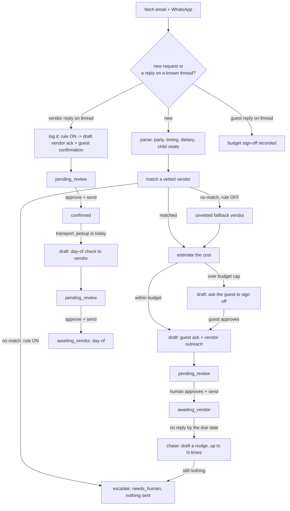

# How Concierge AI works

Concierge AI ("the Fixer") turns a guest's concierge request — a private chef,
an airport transfer, tickets, live music, anything the property arranges
through an outside supplier — into a booked, confirmed, closed-out job with a
human approving every message that leaves the building.

## The loop

`tools/engine.py` holds every decision as a pure function: `parse_request`,
`match_vendor`, `unvetted_fallback`, `estimate_for`, `over_budget`, and the
`build_*` template functions. None of them touch the network, the database or
a model — see the spec's own engine header, ported faithfully: *"Deliberately
conservative... the vetted book is fixed so the AI cannot invent a supplier
that isn't on it."* The only model call in the automatic loop is
`translate_draft` (put a guest-facing draft into the guest's language) — it
degrades to the English draft on any failure and never blocks a send.
`narrate` (a short internal note) lives beside it in `tools/engine.py` but is
never called automatically; it is wired only into `tools/report.py --narrate`
as an explicit, opt-in summary — see docs/benefits.md. `tools/run.py`,
`tools/chase.py`, `tools/request.py` and `tools/report.py` are the only
places that call an adapter, the store, or a model.

## What runs when

| Workflow | Cadence | Provider used |
|---|---|---|
| `workflows/10-new-requests.md` (`tools/run.py`) | every 15 minutes, or `make watch` | `llm.provider`, for `translate` (guest-facing drafts only) |
| `workflows/15-chase-and-close.md` (`tools/chase.py`) | daily | none — a chase nudge is vendor-facing and is never translated |
| `workflows/15-chase-and-close.md` (`tools/request.py dayof-sweep`) | daily, morning | none — the day-of check is vendor-facing |
| `workflows/15-chase-and-close.md` (`close-loop`/`dayof-replied`) | on demand | `llm.provider`, for `translate` (the guest-facing reply) |
| `workflows/80-review.md` (`tools/review.py`) | whenever a human is free | none — queue operations only |
| `workflows/85-coach-weekly.md` (`tools/coach.py`) | weekly | `llm.provider` |
| `tools/report.py --narrate` (opt-in) | on demand | `llm.provider`, for `note` — the only other model call in this repo |

## The pipeline (`concierge_requests.pipeline_status`)

`new -> in_progress -> awaiting_guest_budget -> awaiting_vendor -> confirmed -> done`,
with `escalated` reachable from `new`/`in_progress` (no vendor, or chases
exhausted) and `awaiting_vendor` reachable again after a day-of check. This is
this agent's own table (`tools/store_ext.py`), separate from `core.store`'s
`items.review_status`. The two track different things on purpose: a
`concierge_requests` row is the whole job; an `items` row is one message
someone has to approve before it leaves — a single request can have several
(guest ack, vendor outreach, vendor ack, guest confirmation, a chase nudge, a
day-of check), each going through the review queue on its own.

## Detecting a reply, without guessing at its content

The spec's own open question: the demo's vendor reply is scripted, and a real
build needs inbound reply detection. This template adds it, conservatively.
Every outreach is sent on a stable thread id (`<ref>-vendor` for the vendor
side, the guest's own email thread or WhatsApp `chat_id` for the guest side).
`tools/chase.py` and `tools/request.py dayof-sweep` call
`email.fetch_thread(thread_id)` / re-scan messaging for that `chat_id` and
compare against what is already logged. A new message on a known thread is
logged as a reply automatically — but the agent never tries to read *what it
says*. It surfaces the text to a human (`needs_human` when the rule requires
a decision, `pending_review` when it only needs an approve-and-send) rather
than guessing "confirmed" from free text. `tools/request.py log-reply` is the
manual fallback for a reply that did not arrive through a connected channel
(the vendor called instead of emailing).

## Idempotency

- `core.store.Store.upsert_item("email"/"whatsapp", external_id, ...)` is
  unique on `(source, external_id)` — re-fetching the same message twice
  never creates a second item.
- `concierge_requests.ref` is issued once via `core.store.Store.next_sequence`
  (never bumped on `--dry-run`) and is the key every thread id, chase task and
  PMS note is built from.
- The chase task per request is unique (`core.store.Store.upsert_task("vendor_chase", request_id, ...)`),
  so re-running the sweep never double-books a follow-up.
- Sending is claimed atomically (`Store.claim_for_send()`); two runners racing
  on the same approved item can never both send it.

## Design decisions where the spec was silent

- **Automatic follow-up (roster promise, no code in the demo).** Built as
  `core.store`'s `tasks` tickler: `chase.interval_hours` and
  `chase.max_follow_ups` in `config/agent.yaml`. `core.store.advance_task`
  auto-escalates after the cap — the agent stops chasing on its own and hands
  it to a person instead of chasing forever.
- **Language (roster promise, no code in the demo).** Templates stay
  deterministic English; `translate_draft` (LLM, `prompts/translate.md`)
  localises the guest-facing text only, only when the guest's detected
  language is not English, and only after the deterministic draft is already
  correct — so a translation failure degrades to English, never to a wrong
  fact.
- **The €500 sign-off has no reply path in the demo.** Added
  `pipeline_status: awaiting_guest_budget` and `tools/request.py
  guest-approved|guest-declined`.
- **The vetted book is a code constant in the demo.** Here it is data:
  `config/vendors.example.yaml`, loaded the same way `hotel.yaml`/`agent.yaml`
  are (`core.config.load_yaml("vendors")`), so a hotel edits its own supplier
  list without touching Python.
- **Folio charge.** No PMS folio-charge write exists on any adapter in this
  family. On close-loop the agent calls `pms.add_note()` (a guarded write) so
  the charge is logged against the reservation for the front desk to post by
  hand — see `docs/integrations.md`.
- **Day-of check stays transport-only**, matching the spec exactly.
- **No sub-agents folded in** — the spec confirms VIP AI and Handwritten
  Letter AI share the same page but are separate roster entries with their
  own repos. The coach layer (`email-coach-ai.appliesTo` names this agent)
  is folded in — `tools/coach.py`, `workflows/85-coach-weekly.md`.

## Where core stops and this agent starts

Everything in `core/` is byte-identical to `factory/core/`. Everything in
`tools/`, `prompts/`, `fixtures/`, `workflows/`, `config/agent.example.yaml`
and `config/vendors.example.yaml` is Concierge AI's own.
